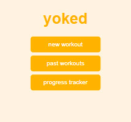
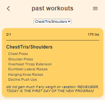
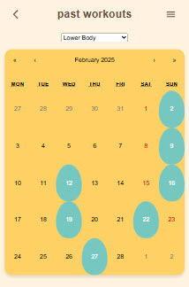

# yoked - a lifting app (In Progress)

This app is a personalized workout tracker designed to help users plan, log, and review their strength training routines. It supports organizing workouts by day, tracking specific movements and sets, and analyzing past performance to support long-term fitness goals.

Watch my progress at: [yoked.netlify.app](https://yoked.netlify.app/)

## Technologies Used

- **Frontend**: [React](https://reactjs.org/) (with [Vite](https://vitejs.dev/)) for a fast, responsive UI  
- **Backend**: [Node.js](https://nodejs.org/) with [Express](https://expressjs.com/) for API handling  
- **Database**: [PostgreSQL](https://www.postgresql.org/) for structured workout and user data  
- **Hosting**: [Netlify](https://www.netlify.com/) for the frontend; backend and database hosted on [Railway](https://railway.app/)

## Key Features

- Create and organize workouts by date  
- Add movements with sets and reps per workout  
- View workout history and progress  
- Responsive design for mobile and desktop

## Screenshots

> Screenshots below showcase current progress and core features in development.

### Home Page

### Past Workouts List

### Past Workouts Calendar

<!-- [Frontend Instructions](frontend/README.md)
- [Backend Instructions](backend/README.md) -->